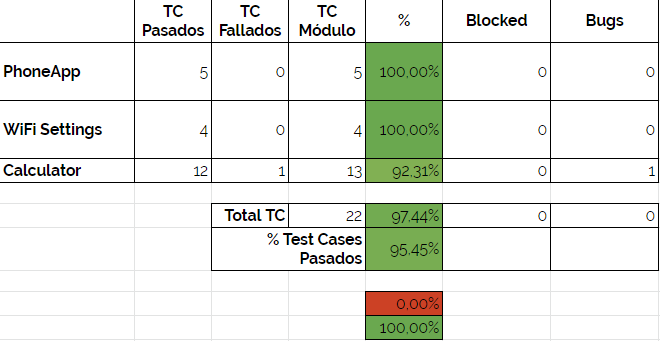

# Release Notes for Android Testing Suite v1.1
SDET: Luis Enrique Correa Morán
May 11th 2020

## Changelog
* Refactored logging and Suite modules, to make logging and test case passing/failing declarations easier in code.
* Added CalculatorSuite for the Calculator module. Currently supports the following operations.
    * Addition
    * Subtraction
    * Multiplication
    * Division
    * Power (EXPERIMENTAL)
* Support for ADR (Asynchronous Device Running) for Test Cases on multiple devices.

## Scope
This release present the results for the second development stage and testing round for the Android Testing Suite. The first three modules, namely the PhoneApp, WiFi Settings & Calculator App modules will be considered for the testing process.

## Test Cases
All the test cases from the Test Case Suite were ran successfully. For more information on the test cases please review the [Test Case Document](https://docs.google.com/spreadsheets/d/13U0UXEtuSqAp-kqhkFW-uvMW_utKNBC43l2fw9tXQbw/edit#gid=0) in the shared folder.

## Test Framework Results
After running the testing suite, the application's output was the following, requiring a time of 2:43 minutes tu complete and passing 100.0% of the test cases.

|Device Serial|Start Time |End Time |Test Case Execution Time |Module |Test Case ID  |Status |                                                                       |
|----------------|---------|---------|---------------|-----------|--------|-------|-----------------------------------------------------------------------|
|0260265948de4167| 22:18:41| 22:18:58| 0:00:17.232204| Calculator| CAL_001| PASSED|                                                                       |
|0260265948de4167| 22:18:58| 22:19:18| 0:00:19.413832| Calculator| CAL_002| PASSED|                                                                       |
|0260265948de4167| 22:19:18| 22:19:39| 0:00:21.180572| Calculator| CAL_003| PASSED|                                                                       |
|0260265948de4167| 22:19:39| 22:19:56| 0:00:17.036593| Calculator| CAL_004| PASSED|                                                                       |
|0260265948de4167| 22:19:56| 22:20:17| 0:00:21.202762| Calculator| CAL_005| PASSED|                                                                       |
|0260265948de4167| 22:20:17| 22:20:38| 0:00:21.020251| Calculator| CAL_006| PASSED|                                                                       |
|0260265948de4167| 22:20:38| 22:20:50| 0:00:12.188765| Calculator| CAL_007| PASSED|                                                                       |
|0260265948de4167| 22:20:50| 22:21:12| 0:00:21.437768| Calculator| CAL_008| PASSED|                                                                       |
|0260265948de4167| 22:21:12| 22:21:22| 0:00:10.450331| Calculator| CAL_009| PASSED|                                                                       |
|0260265948de4167| 22:21:22| 22:21:36| 0:00:13.181778| Calculator| CAL_010| PASSED|                                                                       |
|0260265948de4167| 22:21:36| 22:21:57| 0:00:21.117462| Calculator| CAL_011| PASSED|                                                                       |
|0260265948de4167| 22:21:57| 22:22:26| 0:00:29.185549| Calculator| CAL_012| PASSED|                                                                       |
|0260265948de4167| 22:22:26| 22:22:36| 0:00:10.113881| Calculator| CAL_013| PASSED|                                                                       |
|0260265948de4167| 22:23:41| 22:23:58| 0:00:16.763112| Calculator| CAL_001| PASSED|                                                                       |
|0260265948de4167| 22:23:58| 22:24:18| 0:00:19.970706| Calculator| CAL_002| PASSED|                                                                       |
|0260265948de4167| 22:24:18| 22:24:39| 0:00:21.216057| Calculator| CAL_003| PASSED|                                                                       |
|0260265948de4167| 22:24:39| 22:24:56| 0:00:16.609756| Calculator| CAL_004| PASSED|                                                                       |
|0260265948de4167| 22:24:56| 22:25:17| 0:00:21.332939| Calculator| CAL_005| PASSED|                                                                       |
|0260265948de4167| 22:25:17| 22:25:38| 0:00:21.423845| Calculator| CAL_006| PASSED|                                                                       |
|0260265948de4167| 22:25:38| 22:25:51| 0:00:12.545460| Calculator| CAL_007| PASSED|                                                                       |
|0260265948de4167| 22:25:51| 22:26:12| 0:00:21.359743| Calculator| CAL_008| PASSED|                                                                       |
|0260265948de4167| 22:26:12| 22:26:23| 0:00:10.241450| Calculator| CAL_009| PASSED|                                                                       |
|0260265948de4167| 22:26:23| 22:26:36| 0:00:13.471973| Calculator| CAL_010| PASSED|                                                                       |
|0260265948de4167| 22:26:36| 22:26:58| 0:00:21.472054| Calculator| CAL_011| PASSED|                                                                       |
|0260265948de4167| 22:26:58| 22:27:26| 0:00:28.575871| Calculator| CAL_012| PASSED|                                                                       |
|0260265948de4167| 22:27:26| 22:27:36| 0:00:10.332357| Calculator| CAL_013| PASSED|                                                                       |
|ZY326PJVC9      | 22:34:28| 22:34:43| 0:00:14.839635| Calculator| CAL_001| PASSED|                                                                       |
|ZY326PJVC9      | 22:34:43| 22:34:56| 0:00:13.314892| Calculator| CAL_002| PASSED|                                                                       |
|ZY326PJVC9      | 22:35:36| 22:35:51| 0:00:15.201683| Calculator| CAL_001| PASSED|                                                                       |
|ZY326PJVC9      | 22:35:59| 22:36:14| 0:00:14.793598| Calculator| CAL_001| PASSED|                                                                       |
|ZY326PJVC9      | 22:36:14| 22:36:22| 0:00:07.635073| Calculator| CAL_002| PASSED|                                                                       |
|ZY326PJVC9      | 22:36:22| 22:36:31| 0:00:08.775644| Calculator| CAL_003| PASSED|                                                                       |
|ZY326PJVC9      | 22:36:31| 22:36:40| 0:00:09.649764| Calculator| CAL_004| PASSED|                                                                       |
|ZY326PJVC9      | 22:36:40| 22:36:49| 0:00:09.125040| Calculator| CAL_005| PASSED|                                                                       |
|ZY326PJVC9      | 22:36:49| 22:36:58| 0:00:09.075535| Calculator| CAL_006| PASSED|                                                                       |
|ZY326PJVC9      | 22:36:58| 22:37:05| 0:00:06.134281| Calculator| CAL_007| PASSED|                                                                       |
|ZY326PJVC9      | 22:37:05| 22:37:14| 0:00:08.919211| Calculator| CAL_008| PASSED|                                                                       |
|ZY326PJVC9      | 22:37:14| 22:37:18| 0:00:04.341935| Calculator| CAL_009| PASSED|                                                                       |
|ZY326PJVC9      | 22:37:18| 22:37:24| 0:00:06.495493| Calculator| CAL_010| PASSED|                                                                       |
|ZY326PJVC9      | 22:37:24| 22:37:34| 0:00:09.258408| Calculator| CAL_011| PASSED|                                                                       |
|ZY326PJVC9      | 22:37:34| 22:37:46| 0:00:11.967756| Calculator| CAL_012| PASSED|                                                                       |
|ZY326PJVC9      | 22:37:46| 22:37:50| 0:00:04.275932| Calculator| CAL_013| FAILED| (expected:received) (0.33333333333:0.333333333)                       |
|0260265948de4167| 22:39:04| 22:39:20| 0:00:16.396669| Calculator| CAL_001| PASSED|                                                                       |
|0260265948de4167| 22:39:20| 22:39:29| 0:00:08.987028| Calculator| CAL_002| PASSED|                                                                       |
|0260265948de4167| 22:39:29| 22:39:40| 0:00:10.486074| Calculator| CAL_003| PASSED|                                                                       |
|0260265948de4167| 22:39:40| 22:39:51| 0:00:11.228876| Calculator| CAL_004| PASSED|                                                                       |
|0260265948de4167| 22:39:51| 22:40:02| 0:00:10.670823| Calculator| CAL_005| PASSED|                                                                       |
|0260265948de4167| 22:40:02| 22:40:12| 0:00:10.338731| Calculator| CAL_006| PASSED|                                                                       |
|0260265948de4167| 22:40:12| 22:40:19| 0:00:07.217399| Calculator| CAL_007| PASSED|                                                                       |
|0260265948de4167| 22:40:19| 22:40:30| 0:00:10.512081| Calculator| CAL_008| PASSED|                                                                       |
|0260265948de4167| 22:40:30| 22:40:35| 0:00:04.703858| Calculator| CAL_009| PASSED|                                                                       |
|0260265948de4167| 22:40:35| 22:40:42| 0:00:07.877268| Calculator| CAL_010| PASSED|                                                                       |
|0260265948de4167| 22:40:42| 22:40:53| 0:00:10.330138| Calculator| CAL_011| PASSED|                                                                       |
|0260265948de4167| 22:40:53| 22:41:06| 0:00:12.821636| Calculator| CAL_012| PASSED|                                                                       |
|0260265948de4167| 22:41:06| 22:41:10| 0:00:04.756939| Calculator| CAL_013| FAILED| (expected:received) (0.33333333333:0.33333333333333333333333333333333)|

## Test Suites Summary
The summary for all test cases ran for the test suite is presented below. To get further information please go to the [Test Suite Description](https://docs.google.com/spreadsheets/d/13U0UXEtuSqAp-kqhkFW-uvMW_utKNBC43l2fw9tXQbw/edit#gid=0) and the [Traceability Matrix](https://docs.google.com/spreadsheets/d/12QFADBlV2T41ou9senq9e25IrHtyodsENkYXOv9_WGg/edit#gid=0).

## Bug Reports
The following bugs have been reported from testing round.

* CALB_001: Framework fails to validate calculator results for irrational numbers that have no finite representation of themselves.

## Action Plan
Proceeding to deploy the v1.1 of the Android Testing Suite. Fixing all major bugs before the next release.